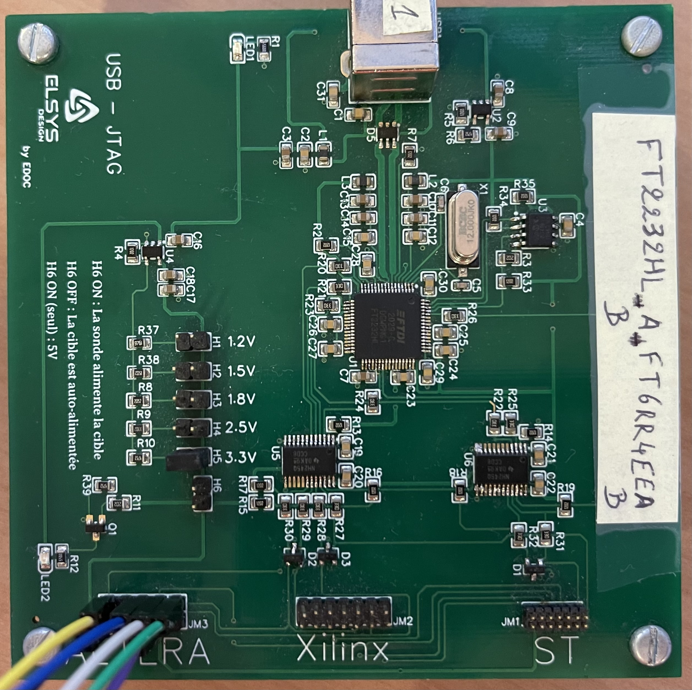
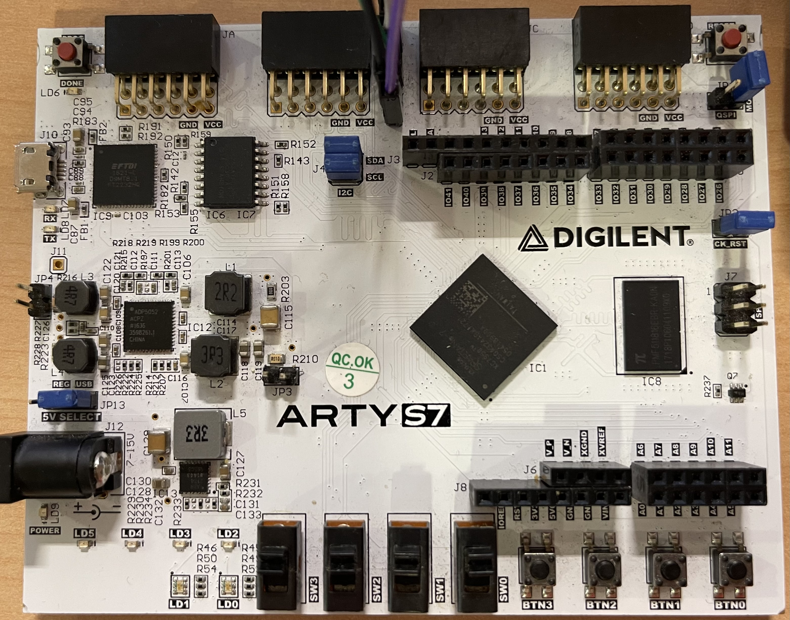

# ELSYS BOARD ARTY S7 EXAMPLE

This example will be based on the docker image of panduza-cxx-platform that will contain the plugin.

## HARDWARE USED

This projet use a probe and a DUT

- The probe developped internally in ELSYS DESIGN which is a USB-JTAG probe that is based on the FT2232HL chip.

- The DUT is a ARTY S7.

## JTAG CONNECTION PINOUT

To allow the probe to connect to the DUT, the connection is made via JTAG.
The connection is made as below (take the direction of the board the picture of the hardware used):
 
 

## FT2232HL Device name

As defined in the tree.json (panduza/tree.json), the probe name need to be "FT2232HL A FT6RR4EEA".
For this, the Serial number should be "FT6RR4EE" and the Product Description should be "FT2232HL".
This should be editable with the software FT_Prog.

## Starting the program

Please refer to the start of the docker image of the platform for that.