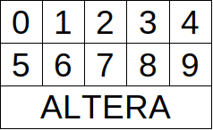
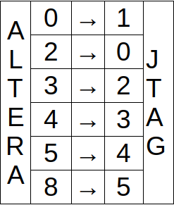
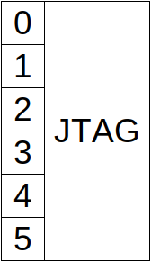

# ELSYS BOARD ARTY S7 EXAMPLE

## FOLDER PLACEMENT

To allow the projet to work, panduza-cxx-platform and panduza-cxx-class-boundary-scan have to be placed of a same folder.

folder
  |--- panduza-cxx-platform
  |--- panduza-cxx-class-boundary-scan

## HARDWARE USED

This projet use a probe and a board to test

- The probe developped internally in ELSYS DESIGN which is a USB-JTAG probe that is based on the FT2232HL chip.


- The board to test is a ARTY S7.


## JTAG CONNECTION PINOUT

To allow the probe to connect to the board to test, the connection is made via JTAG.
The connection is made as below (take the direction of the board the picture of the hardware used):
    


With theses conditions met and the conditions desccribed in the readme from the platform,
the example should work by launching with docker-compose.

The command to launch from this folder is : 

```sh
docker-compose build
docker-compose up
```
